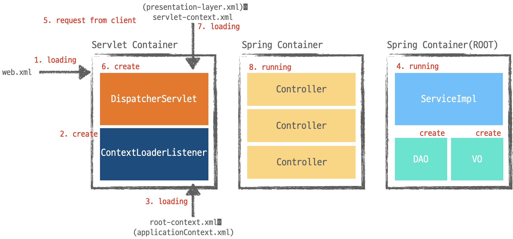
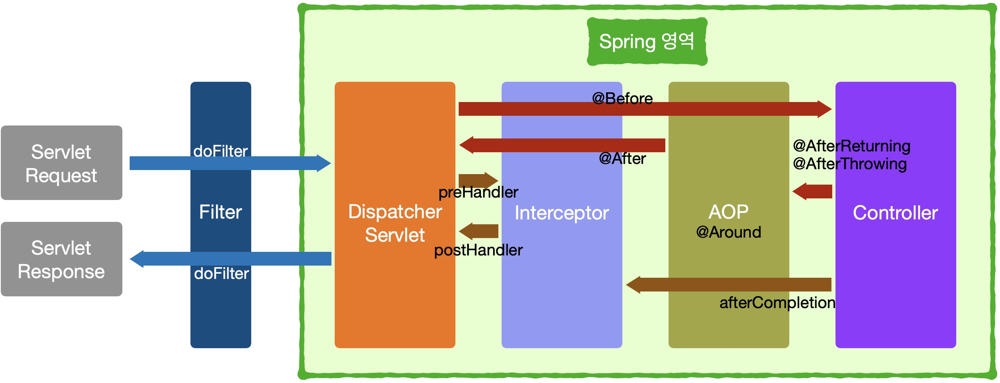

# Spring Framework

Spring Framework 공부 공간입니다.

### Spring Framework?

JAVA 엔터프라이즈 개발을 위한 **"오픈소스(Open Sour5ce)"** 애플리케이션 프레임워크

- Framework : 개발할 때 설계 기본이 되는 뼈대나 구조 / 환경 (문제 영역을 해결한 재사용, 확장 가능한 라이브러리)

종속 객체를 생성하고, 조립할 수 있는 프레임 워크

자바 SE로 된 자바 객체(POJO)를 자바EE에 의존적이지 않게 연결해준다.

- 구현을 위해 특정한 인터페이스를 구현하거나 상속을 받을 필요가 없어 기존에 존재하는 라이브러리 등을 지원하기에 용이하고 객체가 가벼움.

- [POJO(Plain Old Java Object)](https://ko.wikipedia.org/wiki/Plain_Old_Java_Object) : 단순히 평범한 자바빈즈(Javabeans) 객체를 의미한다.

### Spring Framework 구조

<!-- Todo. Spring Framework 구조 내용 추가 필요 -->

### Spring Framework 동작 원리

_스프링 프레임워크는 POJO 만으로 어떻게 동작할까? 내부에서는 어떤 Sevlet, Java Class 들이 동작하는 걸까?_

1. 웹 애플리케이션이 실행되면 Tomcat(WAS)에 의해 `web.xml`이 loading 된다.

2. `web.xml`에 등록되어 있는 `ContextLoaderListener`(Java Class)가 생성된다. `ContextLoaderListener`클래스는 `ServletContextListener` 인터페이스를 구현하고 있으며, `ApplicationContext`를 생성하는 역할을 수행한다.

3. 생성된 `ContextLoaderListener`는 `root-context.xml`을 loading 한다.

4. `root-context.xml`에 등록되어 있는 Spring Container가 구동된다. 이 때 개발자가 작성한 비즈니스 로직에 대한 부분과 DAO, VO 객체들이 생성된다.

5. 클라이언트로부터 웹 애플리케이션이 요청이 온다.

6. `DispatcherServlet`(Servlet)이 생성된다. `DispatcherServlet`은 _FrontController_ 의 역할을 수행한다.
   클라이언트로부터 요청 온 메시지를 분석하여 알맞은 _PageController_ 에게 전달하고 응답을 받아 요청에 따른 응답을 어떻게 할 지 결정만 한다. 실질적인 작업은 _PageController_ 에서 이루어지기 때문이다.
   이러한 클래스들은 `HandlerMapping`, `ViewResolver` 클래스라고 한다.

7. `DispatcherServlet`은 `servlet-context.xml`을 loading 한다.

8. 두번째 Spring Container가 구동되며 응답에 맞는 _PageController_ 들이 동작한다. 이 때 첫번째 Spring Container 가 구성되면서 생성된 DAO, VO, ServiceImpl 클래스들과 협업하여 알맞은 작업을 처리하게 된다.

### 특징

- **"경량 컨테이너"**(크기와 부하의 측면)로서 자바 객체를 직접 관리

  - 각각의 객체 생성, 소멸과 같은 라이프 사이클을 관리하며 스프링으로부터 필요한 객체를 얻어올 수 있다.

- 제어 역행(IoC : Inversion of Control)

  - 애플리케이션의 느슨한 결합을 도모.

  - 컨트롤의 제어권이 사용자가 아니라 프레임워크에 있어 필요에 따라 스프링에서 사용자의 코드를 호출한다.

- 의존성 주입(DI : Dependency Injection)

  - 각각의 계층이나 서비스들 간에 의존성이 존재할 경우 프레임워크가 서로 연결시켜준다.

- 관점지향 프로그래밍(AOP : Aspect-Oriented Programming)

  - 트랜잭션이나 로깅, 보안과 같이 여러 모듈에서 _**공통적으로 사용하는 기능의 경우 해당 기능을 분리**_ 하여 관리할 수 있다.

#### IoC 컨테이너

**IoC Container?**

Bean 즉, IoC Container에서 관리하는 객체의 생성과 관계 설정, 사용, 제거 등의 전체 *라이프 사이클*을 관리해주는 작업을 하는 컨테이너를 **IoC Container**라고 부른다.

#### BEAN 등록 방법

1. xml 설정 파일을 이용한 등록
2. 어노테이션을 이용한 등록 → component scan 필요

#### SPRING LEGACY vs SPRING BOOT

**가장 큰 차이점은 Auto Configuration**
Spring MVC 프로젝트를 Spring Framework 기반으로 구성을 한다면, 컴포넌트 스캔, Bean 설정, Dispatcher Servlet 설정, View Resolve, JDBC 설정 등의 다양한 설정을 해야하지만 이를 Spring Boot 기반으로 구성함으로써 초기 개발 환경 세팅에 걸리는 리소스를 줄일 수 있다.

#### BEAN 주입 방법

<!-- Todo. 나중에 자세하게 다루자 -->

1. @Autowired 어노테이션으로 필드에 주입
2. 생성자를 통한 주입
3. setter를 통한 주입

#### AOP

- 기존의 OOP에서 기능별로 클래스를 분리했지만 여전히 로깅, 트랜젝션, 보안, 자원 해제, 성능 테스트 등 공통적으로 반복되는 중복코드가 여전히 발생하는 단점을 해결하고자 나온 방식이다.

- 개발 코드에서는 비즈니스 로직에 집중하고 실행시에 비즈니스 로직 앞, 뒤 등 원하는 지점에 해당 공통 관심사를 수행할 수 있게 함으로써 중복코드를 줄일 수 있다.

#### DI

<!-- Todo. 디자인 패털, 팩토리 패턴 자세하게 다루자 -->

- 기존초럼 개발코드 부분에서 객체를 생성하지 않고, 팩토리 패턴처럼 객체의 생성과 데이터를 주입만 담당하는 패거리에 해당하는 별도의 공간에서 객체를 생성하고 데이터 간의 의존성을 주입해 개발코드에서는 이를 가져다 씀으로써 의존성을 줄인다.

- 객체가 직접 의존하고 있는 객체를 생성하거나 검색 할 필요가 없어지므로 코드의 관리가 쉬워진다.

#### DTO(Data Transfer Object)

데이터를 주고 받기 위해 사용하는 클래스

#### DAO(Data Access Object)

DataBase에 접근하여 실제 데이터를 조회 또는 조작하는 클래스 (Repository 부분)

#### VA(Value Object)

실제 데이터만을 저장하는 클래스

#### BO(Business Object)

여러 DAO를 활용해 비즈니스 로직을 처리하는 클래스 (Service 부분)

#### Filter, Interceptor, AOP 흐름

- Interceptor와 Filter는 Servlet 단위에서 실행된다. 반면 AOP는 메소드 앞에 _Proxy_ 패턴의 형태로 실행된다.

- 실생순서를 보면 Filter가 가장 밖에 있고 그안에 Interceptor, 그안에 AOP가 있는 형태이다.
  따라서 요청이 들어오면 **_Filter → Interceptor → AOP → Interceptor → Filter_** 순으로 거치게 된다.

1. 서버를 실행시키면 서블릿이 올라오는 동안에 init이 실행되고, 그 후 `doFilter`가 실행된다.

2. 컨트롤러에 들어가기 전에 `preHanlder`가 실행된다.

3. 컨트롤러에 나와 `postHandler`, `after Completion`, `doFilter`순으로 진행된다.

4. 서블릿 종료시 `destory`가 실행된다.

#### Filter, Interceptor, AOP 개념

##### Filter(필터)

말그대로 요청과 응답을 거른뒤 정제하는 역할을 한다.

서블릿 필터는 `DispatcherServlet` 이전에 실행이 되는데 필터가 동작하도록 지정된 자원의 앞단에서 요청내용을 변경하거나, 여러가지 체크를 수핼할 수 있다.

또한 자원의 처리가 끝난 후 응답내용에 대해서도 변경하는 처리를 할 수가 있다.
보통 `web.xml`에 등록하고, 일반적으로 인코딩 변환 처리, XSS 방어 등의 요청에 대한 처리로 사용한다.

###### 필터의 실행메서드

- init() : 필터 인스턴스 초기화

- doFilter() : 전/후 처리

- destory() : 필터 인스턴스 종료

##### Interceptor(인터셉터)

요청에 대한 작업 전/후로 가로챈다고 보면 된다.

필터는 스프링 컨텍스트 외부에 존재하여 스프링과 무관한 자원에 대해 동작한다.
하지만, 인터셉터는 스프링의 DispatcherServlet이 컨트롤러를 호출하기 전, 후로 끼어들기 때문에 스프링 컨텍스트(Context, 영역) 내부에서 Controller(Handler)에 관한 요청과 응답에 대해 처리한다.

스프링의 모든 빈 객체에 접근할 수 있다.

인터셉터는 여러 개를 사용할 수 있고 로그인 체크, 권한체크, 프로그램 실행시간 계산자업 로그확인 등의 업무처리가 가능하다.

###### 인터셉터의 실행메서드

- preHandler() : 컨트롤러 메서드가 실행되기 전

- postHandler() : 컨트롤러 메서드 실행직 후 view 페이지 렌더링 되기 전

- afterCompletion() : view 페이지가 렌더링 되고 난 후

##### AOP

OOP를 보완하기 위해 나온 개념이다.

객체 지향의 프로그래밍을 했을 때 중복을 줄일 수 없는 부분을 줄이기 위해 종다면(_관점_)에서 바라보고 처리한다.

주로 '로깅', '트랜잭션', '에러 처리' 등 비즈니스단의 메서드에서 조금 더 세밀하게 조정하고 싪을 때 사용한다.

Interceptor나 Filter와는 달리 메소드 전후의 지점에 자유롭게 설정이 가능하다.

Interceptor와 Filter는 주소로 대상을 구분해서 걸러내야하는 반면, **AOP는 주소, 파라미터, 애노테이션 등 다양한 방법**으로 대상을 지정할 수 있다.

AOP의 Advice와 HandlerInterceptor의 가장 큰 차이는 파라미터의 차이다.
Advice의 경우 `JoinPoint`나 `ProceedingJoinPoint` 등 을 활용해서 호출한다.
반면, HandlerInterceptor는 Filter와 유사하게 `HttpServletRequest`, `HttpServletResponse`를 파라미터로 사용한다.

###### AOP의 포인트컷

- @Before : 대상 메서드의 수행 전

- @After : 대상 메서드의 수행 후

- @After-returning : 대상 메서드의 정상적인 수행 후

- @After-throwing : 예외발생 후

- @Around : 대상 메서드의 수행 전/후

#### Spring MVC

MVC 패턴의 처리 과정

1. `DispatcherServlet` 가 요청을 받는다.

2. `DispatcherServlet`은 적절한 `controller`를 선택하는 작업을 `HandlerMapping`에 전달한다.
   `HandlerMapping`은 들어오는 요청 URL에 매핑되는 controller를 선택하고 (`selected Handler`) 및 `Controller`를 `DispatcherServlet`에 반환한다.

3. `DispatcherServlet`은 `Controller`의 비지니스 로직을 수행하는 작업을 `HandlerAdapter`로 전달한다.

4. `HandlerAdapter`는 `Controller`의 비지니스 로직 프로세스를 호출한다.

5. `Controller`는 비지니스 로직을 실행하고 처리 결과를 `Model`에 설정하고 `View`의 논리적 이름을 `HandlerAdapter`에 반환한다.

6. `DispatcherServlet`은 View 이름에 해당하는 `View`를 해석하는 작업을 `ViewResolver`에 전달한다. `ViewResolver`는 View 이름에 매핑된 `View`를 반환한다.

7. `DispatcherServlet`은 반환된 `View`에 렌더링 프로세스를 전달한다.

8. `View`는 `Model` 데이터를 레더링하고 응답을 반환한다.

### 하위 프로젝트

- [Spring Boot](./springBoot/README.md)

- [Spring Security](./springSecurity/README.md)

- [Srping WebFlux](./springWebFlux/README.md)

- [Spring Cloud](./springCloud/README.md)

---

**참고**

[\'갓대희\'님의 [Spring]스프링(Spring) 정의 및 특징 정리](https://goddaehee.tistory.com/156?category=173020)

[\'갓대희\'님의 [Spring]Filter, Interceptor, AOP 차이 및 정리](https://goddaehee.tistory.com/154)

[\'하고싶은거 다 해\'님의 \'기술 면접 - SPRING\'](https://ltk3934.tistory.com/86)

[\'\_Jbee\'님의 Spring 의 시작, 프레임워크의 구성요소와 동작 원리](https://asfirstalways.tistory.com/334)

[Overview of Spring MVC Archtecture](https://terasolunaorg.github.io/guideline/1.0.1.RELEASE/en/Overview/SpringMVCOverview.html#id2)
